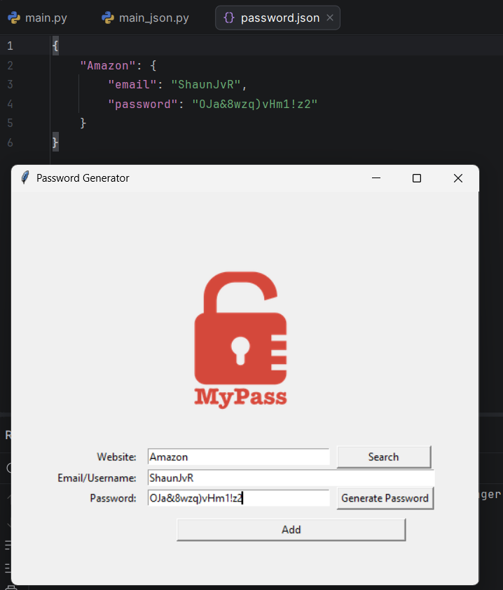

# Data Portfolio – Shaun

Welcome to my data portfolio. This repository showcases selected projects involving SQL, Power BI, Python, and R.

---

## 📄 Recommendations

- [Recommendation from Kerv](./shaun_kerv_recommendation.pdf)  
- [Recommendation from Taigan](./Taigan_Recommendation.pdf)

## 🔹 Financial Reporting Model (Power BI)

**Tools:** SQL, Power BI, DAX  
**Description:**  
Built a scalable financial reporting model including revenue, gross profit, and performance metrics. Data was extracted and transformed using SQL before being modelled in Power BI. This includes working with custom structures and advanced SQL to get data in the correct form.

**Key Features:**
- Star schema data model
- Advanced DAX measures
- Financial KPI tracking
- Executive-level dashboard design
- Clickable screenshots below:

-   
-   
- 
-   

---

## 🔹 SQL Data Transformation Examples

**Tools:** SQL  
**Description:**  
Demonstrates data cleaning, aggregation, and transformation logic used to prepare raw transactional data for reporting.

**Files:**
- [Automated Quarterly SP code.sql](Automated%20Quarterly%20SP%20code.sql) – Quarterly data processing stored procedure.  
- [Order Management Stored Proc.sql](Order%20Management%20Stored%20Proc.sql) – Order management reporting stored procedure.  
- [Travel Costs SQL code.sql](Travel%20Costs%20SQL%20code.sql) – Travel costs data extraction and transformation script.  

---

## 🔹 Python Data Analysis & Projects Portfolio

### 🎓 Academic Experience  
During my university studies, I completed coursework focused on data analysis and statistical modelling using Python.

**Key areas covered:**
- Data cleaning and preprocessing  
- Exploratory Data Analysis (EDA)  
- Descriptive statistics and basic modelling  
- Data visualization using Pandas, NumPy, and Matplotlib  

---

### 📚 Continued Learning (Udemy & Self-Study)  
To further develop my programming skills, I completed online courses and built practical projects, focusing on writing clean, functional Python code and improving problem-solving ability.

---

### 🚀 Projects

#### 🎮 Project 1: Higher or Lower Game  
A Python-based command-line game inspired by social comparison games.

**Description:**  
- The user is shown two entities (e.g., celebrities, brands)  
- They must guess which has a higher social media following  
- The game continues with new comparisons for each correct answer  
- The game ends when the user makes an incorrect guess and will output the users final score

**Key Concepts Used:**
- Python control flow (`if/else`, loops)  
- Randomization using the built-in `random` module  
- Working with dictionaries and lists  
- User input handling
- [Higher or Lower Game Code.txt](Higher%20or%20Lower%20Game%20Code.txt) – Code used to create Higher or Lower Game.

**Preview:**  

---
#### ☕ Project 2: Coffee Machine Simulator  
A Python-based command-line program that simulates a coffee vending machine.

**Description:**  
- The user can order drinks: espresso, latte, or cappuccino  
- The machine checks if there are enough ingredients (water, milk, coffee)  
- The user inserts coins to pay for the drink  
- The machine calculates if the payment is sufficient, gives change, and updates total profit  
- Users can type `"report"` to see remaining ingredients and total money earned  
- The program continues until the user turns the machine off  

**Key Concepts Used:**  
- Python control flow (`if/else`, loops)  
- Working with dictionaries for menu and resources  
- Functions to improve the program (`is_resource_sufficient`, `process_coins`, `is_transaction_successful`, `make_coffee`)  
- User input handling  
- Arithmetic operations for payments and change calculation  
- Global variables (`profit`)  
- [Coffee Vending Machine Code.txt](Coffee%20Vending%20Machine%20Code.txt) – Code used to create the Coffee Machine Simulator  

**Preview:**  

---

#### 🐢 Project 3: Turtle Game

A Python-based arcade-style game built using the Turtle graphics library.

**Description:**

- The player controls a turtle that must cross the road safely
- Cars randomly spawn and move across the screen
- The player levels up each time they reach the finish line
- The game ends if the turtle collides with a car
- Difficulty increases as the level goes up

**Key Concepts Used:**

- Object-Oriented Programming (OOP) with multiple classes
- Python control flow (if/else, loops)
- Event listeners for keyboard controls (Up, Down, Left, Right)
- Collision detection using distance checking
- Game loop using time.sleep() and screen.update()
- Modular programming using multiple Python files (main.py, player.py, car_manager.py, scoreboard.py)
- Inheritance using turtle.Turtle

**Files Included and Preview:**

- **main.py** – Main game loop and controls - 
- **player.py** – Player movement logic - 
- **car_manager.py** – Car spawning and movement system - 
- **scoreboard.py** – Level tracking and game over display - 

**Gameplay Video:**

[🎥 Watch the Gameplay Video](https://github.com/ShaunJvR-DataAnalytics/Data-Repository/raw/main/Turtle%20Game.mp4)

---

#### 🔒 Project 4: Password Manager

This project demonstrates how to build a fully functional password manager application using Python. It allows users to generate strong passwords, store credentials securely, and retrieve them instantly through a clean and intuitive Tkinter-based GUI.

The application emphasizes **error handling, data persistence, and user experience design**.

**Description:**

- This project is a simple but powerful Password Manager application that helps users generate and store secure passwords for different websites.
- Users can enter a website, email/username, and generate a strong random password. The app can also copy the password to the clipboard and save all details locally in a text file for later use.

**Features**

**Secure Password Generation**
- Randomized combination of letters, numbers, and symbols
- Uses Python’s `random` module and list comprehensions
- Automatically copies generated passwords to clipboard using `pyperclip`

**Persistent Data Storage (JSON)**
- Stores credentials in a structured `password.json` file
- Supports creating new files if none exist
- Merges new entries with existing data safely

**Search Functionality**
- Quickly retrieves saved credentials by website name
- Displays email and password in a popup window
- Handles missing entries gracefully

**Error Handling**
- Handles:
  - FileNotFoundError (missing JSON file)
  - JSONDecodeError (empty/corrupted file)
  - KeyError (missing website data)
- Prevents crashes and improves user experience

**Input Validation & UX**
- Prevents saving empty fields
- Automatically clears input fields after saving
- Standardized website formatting for consistent lookup

**GUI (Tkinter)**
- Built using Tkinter widgets (Label, Entry, Button, Canvas)
- Clean grid-based layout
- Includes logo and styled interface

---

**Concepts Used**

- Tkinter GUI development
- Event-driven programming
- Functions and modular code design
- Exception handling (`try`, `except`, `else`, `finally`)
- JSON file handling
- Python dictionaries
- List comprehensions
- Clipboard automation (`pyperclip`)
- Random password generation

---

**How It Works**

1. Enter website, email/username
2. Generate a secure password (optional)
3. Click **Add** to save credentials:
   - Data is validated
   - Stored in `password.json`
4. Click **Search** to retrieve saved credentials

**Files Included and Preview:**

- **main.py** – Main application logic and UI setup - 

**Password Manager Preview:**

 

---
## 🔹 R Statistical Modelling

**Tools:** R  
**Description:**  
Completed during university coursework. The work included regression modelling, hypothesis testing, ANOVA, and model validation, as well as data visualization using ggplot2. Additionally, I completed my honours project in R focusing on ANCOVA. Original scripts are not available.
